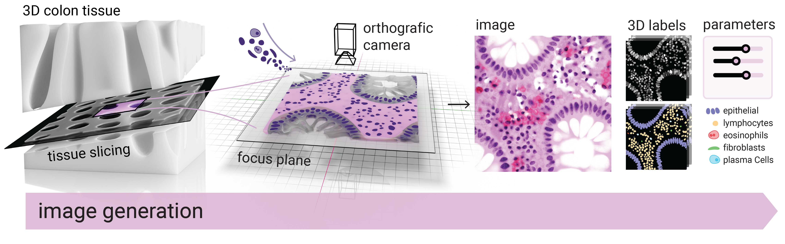

# Arctique

Arctique: ARtificial Colon Tissue Images for Quantitativ Uncertainty Evaluation

With this tool you can generate synthetic images of microscopic colon tissue images, which A) exhibit a complexity comparable to real images, B) can be manipulated and re-rendered in a controlled fashion, and C) are rendered together with the exact pixelwise nuclei masks - instance and semantic. This makes Arctique a powerful tool for the evaluation of concepts such as uncertainty quantification.

As shown below, to mimic the complex structure of real colon tissue images ...




## Installation

1) Clone the repository
2) Make a new conda/micromamba environment with python 3.10
```bash
micromamba create -n arctique python=3.10.0
```
```bash
conda create -n arctique python=3.10.0
```

2) Install the requirements via pip
```bash
pip install -r requirements.txt
```

done :) Now we can use blender without the need to install the full suite.


## Quickstart

### Generate an example
 
Let's generate an example image and its corresponding masks as shown in the figure above. To do so, you can simply run the following command in the terminal:

```bash
python render.py --start-idx 42 --n-samples 1
```

This will render exactly one example with index 42, which implies the seed in the reandom generation process. To render more subsequent examples, you can increase the `--n-samples` argument. If you want to render examples with different seeds, you can change the `--start-idx` argument.

The rendered image and its corresponding mask will be saved in the `rendered` folder with the following structure:


```bash
render
├── images
│   ├── image_0.png
│   ├── ...
└── masks
    ├── instance
    │   ├── 0.tif
    │   ├── ...
    ├── semantic
    │   ├── 0.tif
    │   ├── ...
    ├── cytoplasm
    │   ├── 0.tif
    │   ├── ...
    ├── instance_3d
    │   ├── 0
    │   │   ├── 0_0.tif
    │   │   ├── 0_1.tif
    │   │   ├── ...
    │   │   ├── 0_stack.npy
```

### Generate a variation of a rendered example

The full power of the Arctique framework unfolds when varying the scene gradually, which allows to study concepts such as uncertainty in a controlled manner. To this end, we provide parameter sliders such as:

- example

In order to generate a variation of a rendered example, you can use the following command:

```bash
python render_variation.py 
```