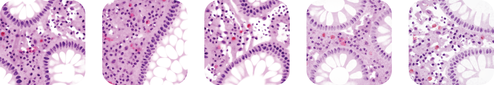
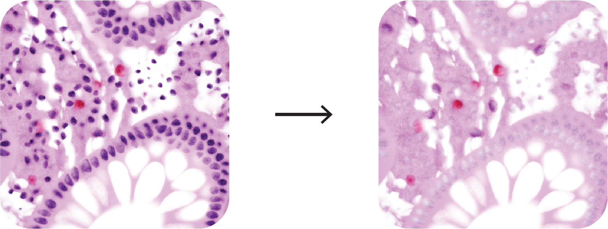

# ARCTIQUE

This repository corresponds to the dataset generation code for the NeurIPS 2024 Datasets and Benchmark Track Paper: 

**Arctique: An artificial histopathological dataset
unifying realism and controllability for uncertainty
quantification** Jannik Franzen, Claudia Winklmayr, Vanessa E. Guarino, Christoph Karg, Xiaoyan Yu, Nora Koreuber, Jan P. Albrecht, Philip Bischoff, Dagmar Kainmueller; https://arxiv.org/pdf/2411.07097, when using ARCTIQUE, please cite our work

So what exactly is ARCTIQUE? **AR**tificial **C**olon **T**issue **I**mages for **Q**uantitativ **U**ncertainty **E**valuation. These images: A) exhibit a complexity comparable to real images, B) can be manipulated and re-rendered in a controlled fashion, and C) are rendered together with the exact pixelwise nuclei masks (instance and semantic). This makes Arctique a powerful tool for method evaluation; in particular uncertainty quantification.

To render complex sceneries, we use blender's python API, mimicking the workflow of histopathological imaging (as shown below): a) generate a 3D model of the tissue, b) slice through the tissue and populate it with nuclei of different cell types, c) render the 2D image and its instance and semantic masks (2D and 3D).


## Installation

1) Clone the repository
2) Make a new conda/micromamba environment with python 3.10 and activate it
```bash
micromamba create -n arctique python=3.10.0 -c conda-forge
```
```bash	
micromamba activate arctique
```

2) Install the requirements via pip
```bash
pip install -r requirements.txt
```

done :sparkles: Now we can use blender without the need to install the full suite.

We tested ARCTIQUE on Linux and Windows.


## Pre-Rendered Datasets

Since the scene creation and 3D ray tracing can take quite some time, we make all pre-rendered datasets public on Zenodo. To recreate or manipulate the pre-rendered samples, you can use the following code version:

| Code version | Dataset version | Zenodo-Link |
| -| - | - |
| **1.0.0** | **v3** (~3k: 1.5k normal / 1.5k noisy / variations on 50 samples) | [14016860](https://zenodo.org/records/14016860) |
| 0.1.1 | **v2** (~50k including variations for 50 samples) |  [12704955](https://zenodo.org/records/12704955) |


## Quickstart

### Generate an example
 
Let's generate an example image and its corresponding masks such as:



To do so, you can simply run the following command in the terminal:

```bash
python render.py --start-idx 42 --n-samples 1
```

This will render exactly one example with index 42, which implies the seed in the reandom generation process. To render more subsequent examples, you can increase the `--n-samples` argument. If you want to render examples with different seeds, you can change the `--start-idx` argument. NOTE: The rendering process can take a couple minutes per image. Hence, we recommend to use HPC with GPU resources for generating large-scale datasets.

The rendered image and its corresponding mask will be saved in the `rendered` folder with the following structure:


```bash
render
├── images
│   ├── image_0.png
│   ├── ...
└── masks
    ├── instance
    │   ├── 0.tif
    │   ├── ...
    ├── semantic
    │   ├── 0.tif
    │   ├── ...
    ├── cytoplasm
    │   ├── 0.tif
    │   ├── ...
    ├── instance_3d
    │   ├── 0
    │   │   ├── 0_0.tif
    │   │   ├── 0_1.tif
    │   │   ├── ...
    │   │   ├── 0_stack.npy
```

### Generate a variation of a rendered example

The full power of the ARCTIQUE framework unfolds when varying the scene gradually, which allows to study concepts such as uncertainty in a controlled manner. To this end, we provide parameter sliders to control e.g. the nuclei intensity:




In order to generate a variation of a rendered examples, you can place the original parameter files in the `rendered/parameters_og` folder and the .json file with the altered parameters (e.g. `changed_params.json`) in the `rendered/parameters_changed` folder. Then, you can run the following command in the terminal

```bash
python render_variation.py --file-changed-parameters changed_params.json
```

and it will re-render all the files in the 'parameters_og' folder with the altered parameters. The rendered images and masks will be saved in a folder with the same name as the changed parameter file, e.g. `rendered/changed_params`.
