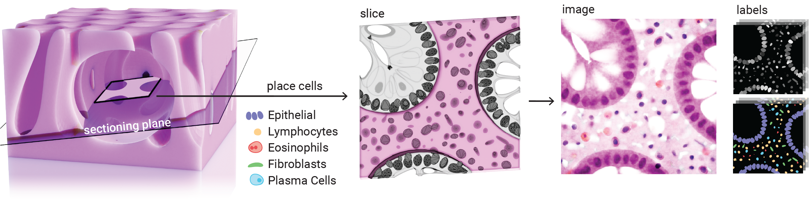

.. _whatis:

What is ARCTIQUE?
=================
ARCTIQUE is a software package that lets you create your synthetic dataset of microscopic colon tissue images.

With this tool you can generate synthetic images of microscopic colon tissue images, which
A) exhibit a complexity comparable to real images,
B) can be manipulated and re-rendered in a controlled fashion, and
C) are rendered together with the exact pixelwise nuclei masks - instance and semantic.

This makes Arctique a powerful tool for the evaluation of concepts such as uncertainty quantification.
As shown below, to mimic the complex structure of real colon tissue images.

